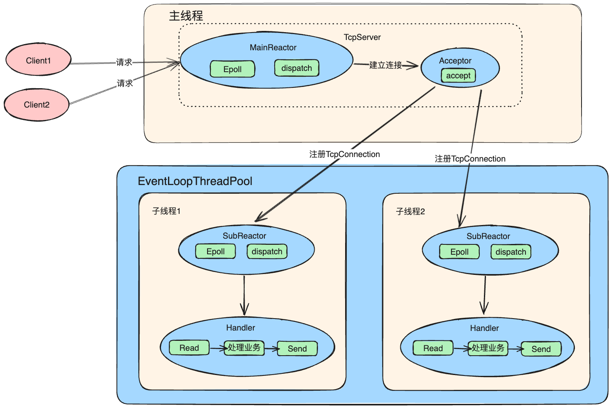
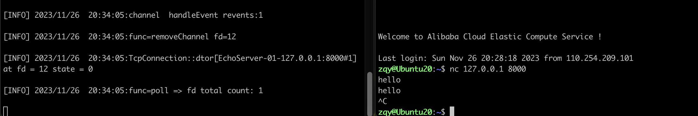

# High Performance Network Library Based on CPP 11


| **Part Ⅰ**            | **Part Ⅱ**            | **Part Ⅲ**            | **Part Ⅳ**            | **Part Ⅴ**            | **Part Ⅵ**            | **Part Ⅶ**            |
| --------------------- | --------------------- | --------------------- | --------------------- | --------------------- | --------------------- | --------------------- |
| [项目介绍](#项目介绍) | [项目特点](#项目特点) | [开发环境](#开发环境) | [并发模型](#并发模型) | [构建项目](#构建项目) | [运行案例](#运行案例) | [相关讲解](#模块讲解) |


## 项目介绍

本项目是参考 muduo 实现的基于 Reactor 模型的多线程网络库。使用 C++ 11 编写去除 muduo 对 boost 的依赖，内部实现了一个小型的 HTTP 服务器，可支持 GET 请求和静态资源的访问，且附有异步日志监控服务端情况。

项目已经实现了 Channel 模块、Poller 模块、事件循环模块、HTTP 模块、定时器模块、异步日志模块、内存池模块、数据库连接池模块。   

## 项目特点

- 底层使用 `Epoll + LT` 模式的 I/O 复用模型，并且结合非阻塞 I/O  实现主从 Reactor 模型。
- 采用`one loop per thread`线程模型，并向上封装线程池避免线程创建和销毁带来的性能开销。
- MainReactor中Reactor处理`accept`请求， 使用`Round Robin`给线程池subReactor处理
- 采用 eventfd 作为事件通知描述符，方便高效派发事件到其他线程执行异步任务。
- 遵循 RAII 手法使用智能指针管理内存，减小内存泄露风险。

## 开发环境

- 操作系统：`Ubuntu 22.04.6 LTS`
- 编译器：`g++ 7.5.0`
- 编辑器：`VScode`
- 版本控制：`git`
- 项目构建：`cmake 3.10.2`


## 并发模型



项目采用主从 Reactor 模型，MainReactor 只负责监听派发新连接，在 MainReactor 中通过 Acceptor 接收新连接并轮询派发给 SubReactor，SubReactor 负责此连接的读写事件。

调用 TcpServer 的 start 函数后，会内部创建线程池。每个线程独立的运行一个事件循环，即 SubReactor。MainReactor 从线程池中轮询获取 SubReactor 并派发给它新连接，处理读写事件的 SubReactor 个数一般和 CPU 核心数相等。使用主从 Reactor 模型有诸多优点：

1. 响应快，不必为单个同步事件所阻塞，虽然 Reactor 本身依然是同步的；
2. 可以最大程度避免复杂的多线程及同步问题，并且避免多线程/进程的切换；
3. 扩展性好，可以方便通过增加 Reactor 实例个数充分利用 CPU 资源；
4. 复用性好，Reactor 模型本身与具体事件处理逻辑无关，具有很高的复用性；

## 构建项目

安装Cmake

```shell
sudo apt-get update
sudo apt-get install cmake
```

下载项目

```shell
git clone git@github.com:ZQYnn/NetworkLibraryBaseonCpp11.git
```

执行脚本构建项目

```shell
cd ./NetworkLibraryBaseonCpp11 && bash autobuild.sh
```

## 运行案例

这里以一个简单的回声服务器作为案例，`EchoServer`默认监听端口为`8000`。

```shell
cd ./example
./echoserver
```

执行情况：



## 相关讲解

这里的某些模块会配置 muduo 源码讲解，有些使用的是本项目的源码，不过实现思路是一致的。

- [fintional/bind讲解](./tutorial/prerequsite.md) 

- [多线程讲解](./tutorial/thread.md)

- [智能指针讲解](./tutorial/pointer.md)

- [Channel/Poller/EventLoop模块](./tutorial/chapter1.md)

- [Thread/EventLoopThread/EventLoopThreadPool](./tutorial/chapter2.md)

- [Acceptor/Socket](./tutorial/chapter3.md)
- [TcpConnection/TcpServeru](./tutorial/chapter4.md)
- [<font color = red>常见问题解析</font>](./tutorial/chapter6.md)
- [<font color =red>处理流程深度剖析</font>](./tutorial/chapter5.md)

## 优化计划

1. 添加HTTP模块
2. 添加日志模块

## 参考

- 《Linux高性能服务器编程》
- 《Linux多线程服务端编程：使用muduo C++网络库》 
- 《UNIX网络编程》
- Reactor模型理解 https://zhuanlan.zhihu.com/p/368089289
- https://github.com/chenshuo/muduo