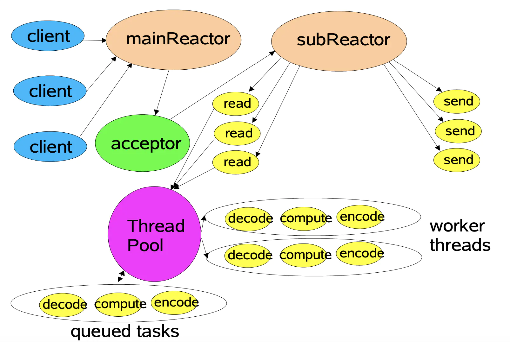

# Thread

在前置知识中我们提到了线程类，以及启动线程的方式

```c++
#include <thread>

void threadHandler(int time)
{
    std::this_thread::sleep_for(std::chrono::seconds(time));
    std::cout << "sub thread" << std::endl;
}
int main()
{
    std::thread t1(threadHandler, 2);
  	// 主线程执行到此阻塞， 等子线程运行结束之后再运行。
    t1.join();
    std::cout << "main thread" << std::endl;
    return 0;
}
```

## Thread主要结构

现在，我们将其封装成Thread类，通过调用成员函数启动线程

```c++
#pragma once

#include "noncopyable.h"
#include <functional>
#include <thread>
#include <memory>
#include <unistd.h>
#include <string>
#include <atomic>
class Thread : noncopyable
{
public:
    using ThreadFunc = std::function<void()>;
    explicit Thread(ThreadFunc, const std::string &name = std::string());
    // 如果使用Thread类直接定义对象， 线程就直接启动
    ~Thread(); 
    void start();
    void join();
  
    bool started() const {return started_;}
    pid_t tid() const {return tid_;}

    const std::string& name() const {return name_;}
    static int numCreated() {return numCreated_;}
private:
    void setDefaultName();
    bool started_;
    bool joined_;
    std::shared_ptr<std::thread> thread_;
    pid_t tid_;
    ThreadFunc  func_; // 存储线程函数 。
    std::string name_;
    static std::atomic_int numCreated_; // 对所有 线程进行计数的
};
```

## 主要成员函数

start 方法功能是启动线程， Thread构造函数参数列表中ThreadFunc 回调函数传入实例化的thread对象中， 实例化对象使用智能指针保存。

```c++
void Thread::start() 
{
    started_ = true;
    sem_t sem;
    sem_init(&sem, false, 0);
    // thread_ = std::shared_ptr<std::thread>)(new std::thread(出入lambda表达 ))
    // [&]() ->void{ }
    // &访问外部对象任意的成员变量
    thread_ = std::shared_ptr<std::thread>(new std::thread([&](){
        tid_ = CurrentThread::tid();
        // 保证获取获取线程ID
        sem_post(&sem);
        func_(); 
    }));
    sem_wait(&sem);
}
```

# EventLoopThread

muduo实现的思想是 `one loop per thread` ， 在此梳理一下EventLoop和thread之间的关系

- 每个线程中只有一个Reactor
- 每个Reactor中对应一个EventLoop
- 每个EventLoop被创建时都会保存创建它的线程值， **EventLoopThread封装了EventLoop以及EventLoop对应线程值。**




## EventLoopThread结构

```c++
#pragma once

#include "Thread.h"
#include "noncopyable.h"
#include <functional>
#include <mutex>
#include <condition_variable>
#include <string>

class EventLoop;
class Thread;

class EventLoopThread : noncopyable
{
public:
    using ThreadInitCallback = std::function<void(EventLoop *)>;
    EventLoopThread(const ThreadInitCallback &cb = ThreadInitCallback(),
        const std::string &name = std::string());
     
    ~EventLoopThread();
    EventLoop* startLoop();
     
private:
    void threadFunc();
    EventLoop  *loop_;
    bool exiting_;
    Thread thread_;
    std::mutex mutex_;  // 互斥锁
    std::condition_variable cond_; // 条件变量
    ThreadInitCallback callback_;
};
```

## 主要成员函数

在EventLoopThread中， 重点关注初始化列表中的构造了Thread类，并且将EventLoopThread中的threadFunc回调函数传入Thread类中，只要Thread类执行start方法后，就可以启动线程函数。

```c++
EventLoopThread::EventLoopThread(const ThreadInitCallback &cb,
        const std::string &name)
        : loop_(nullptr)
        , exiting_(false)
          // 绑定threadFunc线程函数
        , thread_(std::bind(&EventLoopThread::threadFunc, this), name)
        , mutex_()
        , cond_()
        , callback_(cb)
        
{
            
}
```

**EventLoopThread::threadFunc**：在线程函数中创建一个EventLoop， 栈空间临时对象，赋给成员变量`loop_`, 这里利用锁机制保证获取`loop_`地址之后通知 `startLoop` 获取`loop_`地址

```c++
//下面这个方法:是在单独的新线程里面运行的
void EventLoopThread::threadFunc()
{
    // 创建一个独立的EventLoop， 和上面的线程是一一对应的 重点
    EventLoop loop;
    if (callback_)
    {
        callback_(&loop);
    } 
    
    {
        std::unique_lock<std::mutex> lock(mutex_);
        loop_ = &loop;
        cond_.notify_one(); // 和stratLoop 之间返回Loop指针的问题。 
    }
    // 开启底层的poller
    loop.loop(); // EventLoop loop -> poller.loop
    std::unique_lock<std::mutex> lock(mutex_);
    loop_ = nullptr;
}
```


调用startLoop执行thread类中的start 方法开启线程， 并通过线程回调函数`notify_one`之后，表示获取当前 `loop_`地址，并返回。

```c++
EventLoop * EventLoopThread::startLoop()
{
    thread_.start();        // 启动底层线程thread中的func函数 底层线程的回调函数
    
    EventLoop *loop = nullptr;
    {
        std::unique_lock<std::mutex> lock(mutex_);
        while ( loop_ == nullptr) // 等待Func中返回loop指针，线程间通行操作
        {
            cond_.wait(lock);
        }
        loop = loop_;
    }
    return loop;
}
```


#  EventLoopThreadPool

EventLoopThreadPool 就是EventLoopThead的线程池，事件响应过程中出现多个Reactor，每个Reactor对应一个线程， 每个线程中实现一个EventLoop，EventLoopThreadPool就是管理了多个EventLoopThread以及他们的EventLoop集合， 

## EventLoopThreadPool

```c++
#pragma once
#include "noncopyable.h"
#include <functional>
#include <string>
#include <vector>
#include <memory>

class EventLoop;
class EventLoopThread;

class EventLoopThreadPool : noncopyable
{
public:
    using ThreadInitCallback = std::function<void(EventLoop*)>;
    EventLoopThreadPool(EventLoop *baseLoop, const std::string& nameArg);
    ~EventLoopThreadPool();
    
    void setThreadNum(int numThreads) { numThreads_ = numThreads; }
    void start(const ThreadInitCallback &cb = ThreadInitCallback());
    
    EventLoop* getNextLoop();
    // 如果是多线程的话 baseLoop 默认使用轮训的方式分配Channel给subloop
    std::vector<EventLoop*> getAllLoops();

    bool started() const { return started_; }
    
    const std::string& name()const {return name_;}
private:
    //  用户创建的loop
    EventLoop *baseLoop_;
    std::string name_;
    bool started_; 
    int numThreads_;
    int next_;

    
    // 所有事件的线程 
    std::vector<std::unique_ptr<EventLoopThread>> threads_;
    // 所有事件线程的eventLoop指针
    std::vector<EventLoop*> loops_;
};
```

## 主要成员函数

```c++
void EventLoopThreadPool::start(const ThreadInitCallback &cb)
{
    started_ = true;
    
    for (int i = 0; i < numThreads_; i++)
    {
        char buf[name_.size() + 32];
        snprintf(buf, sizeof buf, "%s%d", name().c_str(), i);
        EventLoopThread* t = new EventLoopThread(cb, buf);
        threads_.push_back(std::unique_ptr<EventLoopThread>(t));
        
        // 底层创建线程 绑定一个新的EventLoop 返回Loop的地址 
        loops_.push_back(t->startLoop());
    }

    // numThreads == 0 说明整个服务端只有一个线程， 运行着baseLoop
    if (numThreads_ == 0 && cb)
    {
        cb(baseLoop_);
    }
}
```

