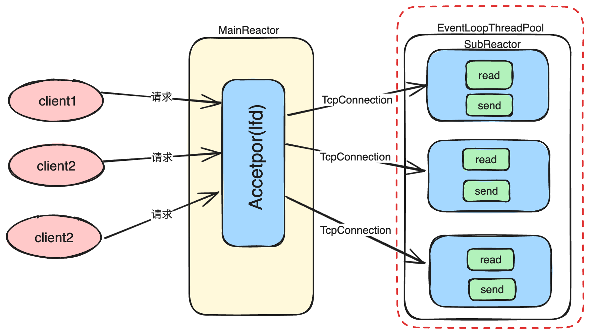

#  执行流程梳理

完成网络库编写后， 查看`example`下的测试用例,  以echoserver作为案例， 讲解整个muduo库的工作流程

```c++
#include <mymuduo/TcpServer.h>
#include <mymuduo/Logger.h>
#include <string>
#include <functional>

class EchoServer
{
public:
    EchoServer(EventLoop *loop,
            const InetAddress &addr, 
            const std::string &name)
        : server_(loop, addr, name)
        , loop_(loop)
    {
        // 注册回调函数
        server_.setConnectionCallback(
            std::bind(&EchoServer::onConnection, this, std::placeholders::_1)
        );

        server_.setMessageCallback(
            std::bind(&EchoServer::onMessage, this,
                std::placeholders::_1, std::placeholders::_2, std::placeholders::_3)
        );

        server_.setThreadNum(3);
    }
    void start()
    {
        server_.start();
    } 
private:
    // 连接建立或者断开的回调
    void onConnection(const TcpConnectionPtr &conn)
    {
        if (conn->connected())
        {
            LOG_INFO("Connection UP : %s", conn->peerAddress().toIpPort().c_str());
        }
        else
        {
            LOG_INFO("Connection DOWN : %s", conn->peerAddress().toIpPort().c_str());
        }
    }
    
    // 可读写事件回调
    void onMessage(const TcpConnectionPtr &conn,
                Buffer *buf,
                Timestamp time)
    {
        std::string msg = buf->retrieveAllAsString();
        conn->send(msg);
        conn->shutdown(); // 关闭写端  EPOLLHUP =》 closeCallback_
    }
    
    EventLoop *loop_;
    TcpServer server_;
};

int main()
{
    EventLoop loop;
    InetAddress addr(8000);
    EchoServer server(&loop, addr, "EchoServer-01"); 
    server.start(); 
    loop.loop();
    return 0;
}
```


## 执行过程

以`echoserver.cc` 为例，仔细分析网络库底层时如何运行起来的， 如何实现基于多线程 实现epoll 复用的，在底层时如何实现Reactor模式的。

## 1.server初始化


初始化echoserver时，完成对TcpServer和 EventLoop的构造。

```c++
EchoServer(EventLoop *loop,
        const InetAddress &addr, 
        const std::string &name)
    : server_(loop, addr, name)
    , loop_(loop)
```

## 2.TcpServer 构造


在构造TcpServer执行的操作

`TcpServer.cc`:

```c++
TcpServer::TcpServer(EventLoop *loop,
                    const InetAddress &listenAddr,
                    const std::string &nameArg,
                    Option option)
                    : loop_(CheckLoopNotNull(loop))
                    , ipPort_(listenAddr.toIpPort())
                    , name_(nameArg)
                    , acceptor_(new Acceptor(loop, listenAddr, option == kReusePort))
                    , threadPool_(new EventLoopThreadPool(loop,  name_))
                    , connectionCallback_()
                    , messageCallback_()
                    , nextConnId_(1)
                    , started_(0)
{
    acceptor_->setNewConncetionCallback(std::bind(&TcpServer::newConncetion, 
    this, std::placeholders::_1,  std::placeholders::_2));
}
```

在构造TcpServer时，创建Acceptor对象用于创建lfd，用于监听事件客户端请求，建立客户端与服务器端的连接，创建`EventLoopThreadPool`对象， 通过多线程处理IO复用请求。


**进行事件绑定**：在`Acceptor`中，通过`acceptSocket_` 创建`lfd` `acceptChannel_`封装`lfd`， Acceptor在mainReactor中，负责监听是否有客户端向服务器端请求建立连接，所以在acceptChannel中绑定读事件`Acceptor::handleRead()`。 

`Acceptor.cc` :

```c++
void Acceptor::handleRead()
{
    InetAddress peerAddr;
    int connfd = acceptSocket_.accept(&peerAddr);
    if (connfd >= 0)
    {
        if (newConnectionCallback_)
        {
             newConnectionCallback_(connfd, peerAddr); 
        }
        else
        {
            ::close(connfd);
        }
    }
}
```

在`Acceptor::handleRead()`中主要执行两件事

- 获取connfd  `int connfd = acceptSocket_.accept(&peerAddr);` 
- 执行建立建立连接的回调函数`newConnectionCallback_`

`newConnectionCallback_`回调函数是在TcpServer构造的时候设置的。

`TcpServer::TcpServer()`:  

 Acceptor中，`newConnectionCallback_`绑定的是`TcpServer::newConnection`

```c++
acceptor_->setNewConncetionCallback(std::bind(&TcpServer::newConncetion, 
    this, std::placeholders::_1,  std::placeholders::_2));
```

以上完成TcpServer的构造，为监听客户端建立连接做好了铺垫。当开启事件循环时，出现连接的时候，执行newConnection函数。

## 3.启动echoServer服务器

在谈完整的启动过程时，先来回顾一下在Muduo中应用到的**多Reactor多线程**模型


在`echoserver `测试代码中  启动服务器。 

```c++
server.start(); ->   server_.start(); //TcpServer.start();
```

在启动TcpServer需要执行哪些操作？

`TcpServer.cc`

```c++
void TcpServer::start()
{
    if (started_++ == 0)
    {
        threadPool_->start(threadInitCallback_); 
        loop_->runInLoop(std::bind(&Acceptor::listen, acceptor_.get()));
    }
}
```

**在TcpServer启动的时候只做了两件事情**

- 启动线程池`threadPool_->start(threadInitCallback_) `

- 开启监听事件 执行`Acceptor::listen` 

     

**启动线程池**

 `EventLoopThreadPool.cc`

```c++
void EventLoopThreadPool::start(const ThreadInitCallback &cb)
{
    started_ = true;
    for (int i = 0; i < numThreads_; i++)
    {
        char buf[name_.size() + 32];
        snprintf(buf, sizeof buf, "%s%d", name().c_str(), i);
        EventLoopThread* t = new EventLoopThread(cb, buf);
        threads_.push_back(std::unique_ptr<EventLoopThread>(t));
        
        // 底层创建线程 绑定一个新的EventLoop 返回Loop的地址 
        loops_.push_back(t->startLoop());
    }
    // numThreads == 0 说明整个服务端只有一个线程， 运行着baseLoop
    if (numThreads_ == 0 && cb)
    {
        cb(baseLoop_);
    }
}
```


**开启事件监听**

`Acceptor.cc` 

```c++
void Acceptor::listen()
{
    listenning_ = true;
    acceptSocket_.listen();
    acceptChannel_.enableReading(); // 开启监听
}
```

**剖析更改事件监听流程** :在Channel 中保存了`event`代表需要监听的事件，将channel.event 传入`epoll_ctl`即可监听事件。 修改其他Channel感兴趣事件同理。

**执行的流程**： `acceptChannel_.enableReading()` -> 

**Channel.cc**

`enableReading() {events_ |= kReadEvent; update();}`  --> 

` update() {loop_->updateChannel(this)}`-->

**EventLoop.cc**

`updateChannel(Channel *channel){ poller_->updateChannel(channel)` -->

**EpollPoller.cc**

`updateChannel()` --> `update()` 最终执行`epoll_ctl`

```c++
void EPollPoller::update(int operation, Channel *channel)
{
    epoll_event event;
    //memset(&event, 0, sizeof event);
    bzero(&event, sizeof event);
    int fd = channel->fd();
    event.data.fd = fd;
    event.events = channel->events();
    event.data.ptr = channel;
    
    // 设置相应event事件 
    if (::epoll_ctl(epollfd_, operation, fd, &event) < 0)
    {
        if (operation == EPOLL_CTL_DEL)
        {
            LOG_ERROR("epoll_ctl del error %d\n", errno);
        }
        else
        {
            LOG_FATAL("epoll_ctl add/mod error %d\n", errno);
        }
    }
}
```


## 4.开启事件循环

开启事件循环

在开启线程池和设置监听事件之后， 直接开启事件循环, 这里启动的是`mainReactor`， 监听客户端建立连接事件。 

`echoserver.cc`

```c++
loop.loop(); // 启动mainLoop的底层Poller
```

`EventLoop.cc`

```c++
void EventLoop::loop()
{
    looping_ = true;
    quit_ = false;
    
    LOG_INFO("EventLoop %p start looping\n", this);
    while (!quit_)
    {
        activeChannels_.clear();
        pollReturnTime_ = poller_->poll(kPollTimeMs, &activeChannels_); 
        for (Channel *channel :  activeChannels_)
        {
            channel->handleEvent(pollReturnTime_);
        }
        doPendingFunctors();
    }
    LOG_INFO("EventLoop %p \n", this); 
    looping_ = false;   
}
```

loop中的重点：`pollReturnTime_ = poller_->poll()` poll 底层调用`epoll_wait`方法,监听客户端建立连接的请求（当前是在MainReactor中 ，只有acceptrChannel 绑定lfd监听客户端建立请求）

`EpollPoller.cc`

```c++
Timestamp EPollPoller::poll (int timeoutMs, ChannelList *activeChannels)
{ 
    int numsEvents = ::epoll_wait(epollfd_, &*events_.begin(), static_cast<int>(events_.size()), timeoutMs);
 
    int saveErrno = errno; 
    
    Timestamp now(Timestamp::now());
    
    return now;
}
```

此时开启`poller`进行监听lfd上读事件， 等待客户端建立连接的请求。

执行到此，已经完成在MainReactor的任务， 即已经完成了下图中 <font color = red>红色</font>圈线部分操作，Reactor执行图如下：


## 5.建立新连接

完成MainReactor上的accept事件后， 当前要做的就是将TcpConnection分发给`SubReactor`过程如下图红线所展示：


监听acceptChannel上是否有事件发生， 需要执行AcceptChannel在`handleRead`中的`TcpServer::newConnection` 回调函数， 建立连接。

```c++
// listenfd 有事件发生了，  出现新用户连接
void Acceptor::handleRead()
{
    // 默认构造
    InetAddress peerAddr;
    int connfd = acceptSocket_.accept(&peerAddr);
    if (connfd >= 0)
    {
        if (newConnectionCallback_)
        {
             newConnectionCallback_(connfd, peerAddr); 
             // 轮询找到subLoop，唤醒，分发当前的新客户端的Channel
        }
        else
        {
            ::close(connfd);
        }
    }
}
```

接受客户端，在分发给subloop之前建立新连接建立连接`newConnection()`

```c++
void TcpServer::newConncetion(int sockfd, const InetAddress &peerAddr)
{
    // 使用轮询算法， 选择一个subloop 来管理channel
    EventLoop *ioLoop = threadPool_->getNextLoop();
    char buf[64] = {0};
    snprintf(buf, sizeof buf, "-%s#%d", ipPort_.c_str(), nextConnId_); 
    ++nextConnId_; 
    std::string connName = name_ + buf;
    
    sockaddr_in local;
    ::bzero(&local, sizeof local);
    socklen_t addrlen = sizeof local;
    if (::getsockname(sockfd, (sockaddr*)&local, &addrlen) < 0)
    {
        LOG_ERROR("sockets::getLocalAddr");
    }
    InetAddress localAddr(local);
    
    TcpConnectionPtr conn(new TcpConnection(ioLoop, connName, sockfd, localAddr, peerAddr));
    
    conncetions_[connName] = conn;
     
    conn->setConnectionCallback(connectionCallback_);
    conn->setMessageCallback(messageCallback_);
    conn->setWriteCompleteCallback(writeCompleteCallback_);
    
    conn->setCloseCallback(
        std::bind(&TcpServer::removeConnection, this, std::placeholders::_1)
    );
    
    ioLoop->runInLoop(std::bind(&TcpConnection::connectEstablished, conn));
}
```


## 6 唤醒SubReactor

在多Reactor模型多线程模型中， MainReactor已经完成了在主线程中监听客户端连接，并且将TcpConnection分发给SubReactor，那么如何让SubReactor启动并执行相应的事件呢？

在回答这个问题之前，我们需要认识到muduo上存在的一个现象— **跨线程调用**

解释跨线程调用的问题，我们不得不回到首次出现跨线程调用的地方 — **`TcpServer::newConnection`**

执行`newConnection`有以下几个步骤：

- 获取ioLoop  `EventLoop *ioLoop = threadPool_->getNextLoop();`
- 创建TcpConnection对象
- 绑定subChannel相关回调函数
- 执行`TcpConntion::connectEstablished`,  `ioLoop->runInLoop(std::bind(&TcpConnection::connectEstablished, conn))`

在MainLoop中调用`threadPool_->getNextLoop` ，获取ioLoop，这就是获取的指向subReactor的指针，那么在主线程中执行子Loop上 的相关回调函数是否可行呢？ 答案是否定的， 在muduo库中遵循了 one loop per thread原则，**即一个eventLoop对应一个子线程，eventLoop执行相关函数需要在属于自己所在的线程中执行**。

那么下面这句话就属于跨线程调用的：

```c++
ioLoop->runInLoop(std::bind(&TcpConnection::connectEstablished, conn));
```

那在muduo中是如何解决跨线程调用的呢？ — `wakeupFd`

回到跨线程调用这句话，在看到`wakeupFd`之前，先剖析在内部是如何调用，在mainLoop中获取subLoop(ioLoop)，当前loop不在自己所在的线程，从而执行`queueInLoop()`

```c++
void EventLoop::runInLoop(Functor cb)
{
    if (isInLoopThread())  
        cb();
    else            
    {
        queueInLoop(cb); // 执行这里
    }
}
```

`EventLoop::queueInLoop`: 将回调函数`TcpConncetion::connectionEsatblished`保存到`pendingFunctors`中, 当前Loop不属于自己所在线程执行`wakeup()`

```c++
void EventLoop::queueInLoop(Functor cb)
{
    {
        std::unique_lock<std::mutex> lock(mutex_);
         pendingFunctors_.emplace_back(cb);
    }
    if(!isInLoopThread() || callingPendingFunctors_)
    {
        wakeup(); // 满足 !isInLoopThread()-> 执行wakeup()
    }
}
```

`EventLoop.cc`: 唤醒loop所对应的线程， 执行相应回调函数`TcpConncetion::connectionEsatblished`

```c++
void EventLoop::wakeup()
{
    uint64_t one = 1;
    ssize_t n = write(wakeupFd_, &one, sizeof one);
    if (n != sizeof one)
    {
        LOG_ERROR("EventLoop::wakeup() writes %lu bytes inside of 8\n", n); 
    } 
}
```

执行`wakeup()`函数， 到这里你可能有疑问，在`wakeup()`中不就是只有一个写操作么？ 那是如何唤醒的呢？

在一开始完成构造线程池对象的时候，已经创建多个eventLoop，每个eventLoop开启了loop方法

```c++
void EventLoop::loop()
{
    looping_ = true;
    quit_ = false;
    while (!quit_)
    {
        activeChannels_.clear();
        pollReturnTime_ = poller_->poll(kPollTimeMs, &activeChannels_); 
        for (Channel *channel :  activeChannels_)
        {
            channel->handleEvent(pollReturnTime_);
        }
        doPendingFunctors();
    }
    LOG_INFO("EventLoop %p \n", this); 
    looping_ = false;   
}
```

`EventLoop.loop()`方法本质上 就是执行  `poller_->poll()`内部`epoll_wait`方法 ，在`TcpConnection::newConnection`完成注册之前，在subLoop的`connfd`监听不到任何事件的,那么就导致子线程阻塞在`epoll_wait`这里，而在EventLoop上执行相应的事件是需要调用 `doPendingFunctors()`的， 目前就出现了在注册TcpConnection的过程中设置回调`TcpConncetion::connectionEsatblished`无法执行， 出现这就现象我们就需要**唤醒操作**

唤醒方法：让EventLoop不要阻塞在poll函数， 运行到`doPendingFunctors()`,就可以完成任务，具体的实现方法如下

1. 每个EventLoop上设置了`wakeupFd_`, 将`wakeupFd_`封装成`wakeupChannel_`
2. 在构造EventLoop对象的时候在Poller上注册可读事件
3. 在`EventLoop::queueInLoop()` 中调用`wakeup()` 通过`wakeupFd_`写数据，`epoll_wait` 检测到可读事件， 解除阻塞问题，进而执行`doPendingFunctors`


`doPendingFunctors` 上执行的是`TcpConnection::ConnectionEstablished`

```c++
void TcpConnection::connectEstablished()
{
    setState(kConnected);
    // 强智能指针保证TcpConnection不被释放,
    channel_->tie(shared_from_this()); 
    // 向poller注册channel的epollin事件 也就是读事件
    channel_->enableReading();
    // 新连接建立 执行回调函数
    connectionCallback_(shared_from_this());
}
```

connectionCallback是用户自己在echoserver中绑定的OnConncetion函数，此时已经唤醒SubReactor并完整地注册好连接。

目前，我们已经完整梳理好唤醒subReactor的来龙去脉：当出现**跨线程调用**的时候，通过`wakeup()`**唤醒**EventLoop，执行相应回调即可，同理出现其他的跨线程调用的情况执行代码逻辑相同。

## 7. subLoop 处理 读写数据

在完成注册TcpConnection之后，着重处理SubReactor上的读写事件，即处理当前红色圈线部分内容



poller中监听sub各种事件 ，TcpConncetion构造时绑定subChannel各种事件回调函数，

```c++
TcpConnection::TcpConnection(EventLoop *loop,
                const std::string &nameArg,
                int sockfd,
                const InetAddress& localAddr,
                const InetAddress& peerAddr)
                : loop_(CheckLoopNotNull(loop))
                , name_(nameArg)
                , state_(kconnecting) 
                , reading_(true)
                , socket_(new Socket(sockfd))
                , channel_(new Channel(loop, sockfd))
                , localAddr_ (localAddr)
                , peerAddr_(peerAddr)
                , highWaterMark_(64 * 1024 * 1024)
                
{
    // 设置Channel的回调函数 poller 给channel 通知对应事件发生， channel执行相应的回调
    channel_->setReadCallback(
        std::bind(&TcpConnection::handleRead, this, std::placeholders::_1)
    );
    
    channel_->setWriteCallback(
        std::bind(&TcpConnection::handleWrite, this)
    );
    
    channel_->setCloseCallback(
        std::bind(&TcpConnection::handleClose, this)
    );
    
    channel_->setErrorCallback(
        std::bind(&TcpConnection::handleError, this)
    );

    LOG_INFO("TcpConnection::ctor[%s] at fd=%d\n", name_.c_str(), sockfd);
    socket_->setKeepAlive(true);
                    
}
```


发生读事件的时候，执行handleRead

```c++
void TcpConnection::handleRead(Timestamp receiveTime)
{
    int savedErrno = 0;
    ssize_t n = inputBuffer_.readFd(channel_->fd(), &savedErrno);
    if (n > 0)
    {
        messageCallback_(shared_from_this(), &inputBuffer_, receiveTime); 
    }
    else  if (n == 0)
    {
        handleClose();
    }
    else
    {
        errno = savedErrno;
        LOG_ERROR("TcpConnection heandleRead");
        handleError();
    }
}
```


下图说明整个网络库的执行流程 ：


​     

​     

​     

​     